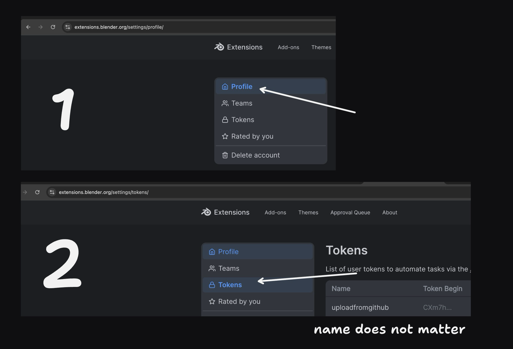
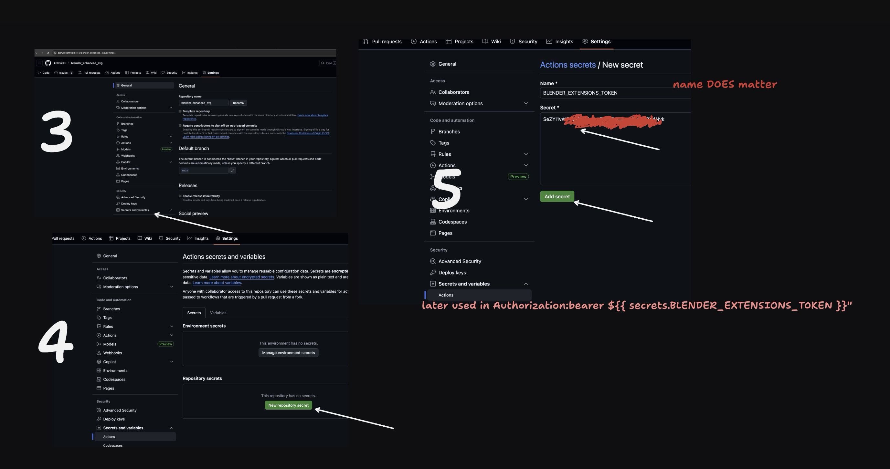

# blender_extension_tutorial

1. Get key from https://extensions.blender.org/settings/profile/

2. paste the key in Github:

3. Copy these two workflows https://github.com/kolibril13/blender_enhanced_svg/tree/main/.github/workflows

4. Tagging a branch will create a draft release

5. This release can be finally realeased form the github UI

6. One that's done, there's an automatic upload to the extension store